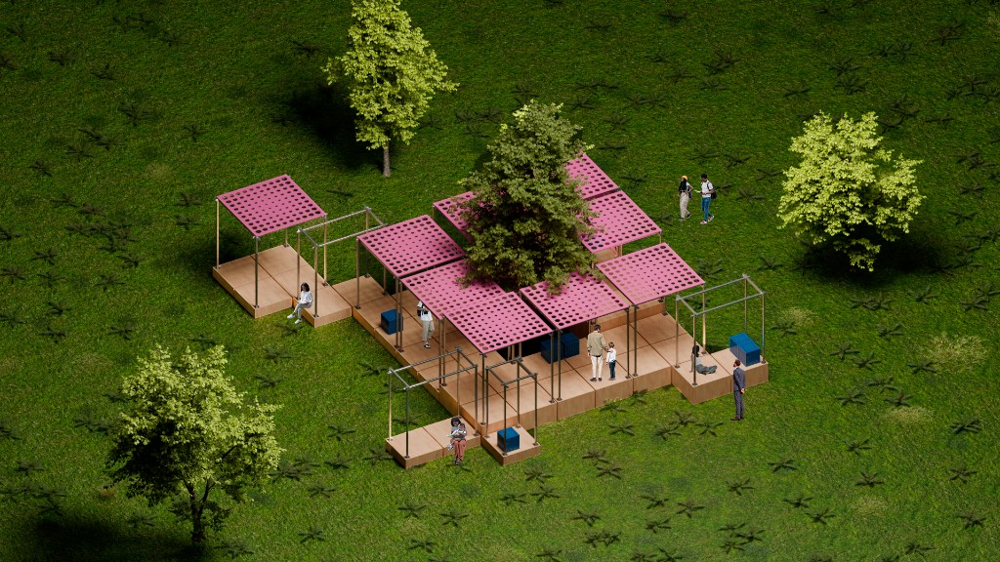
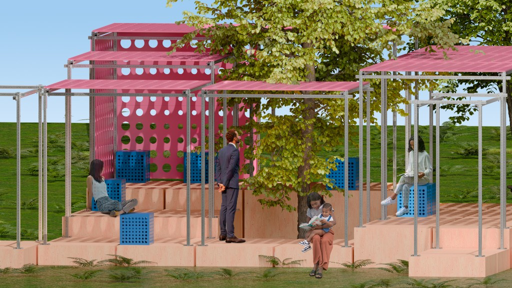
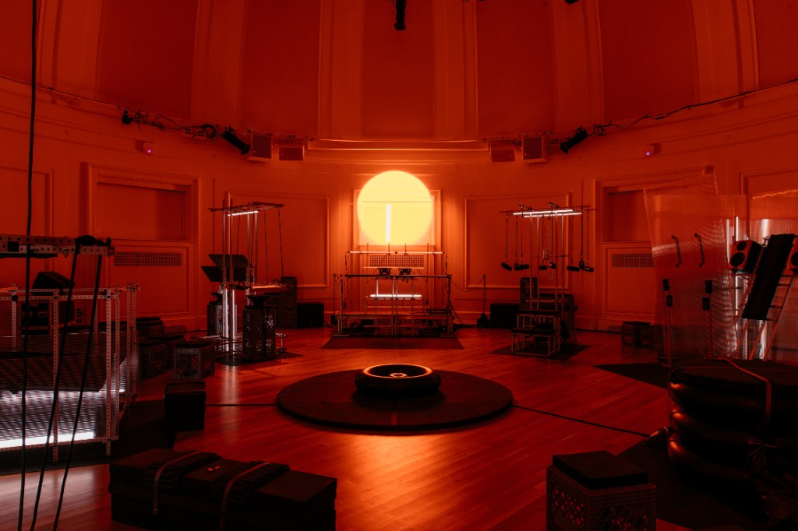
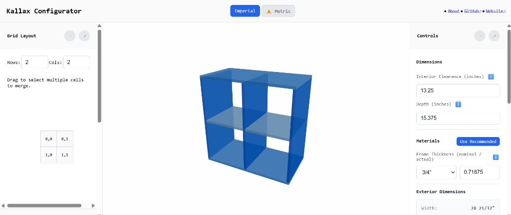
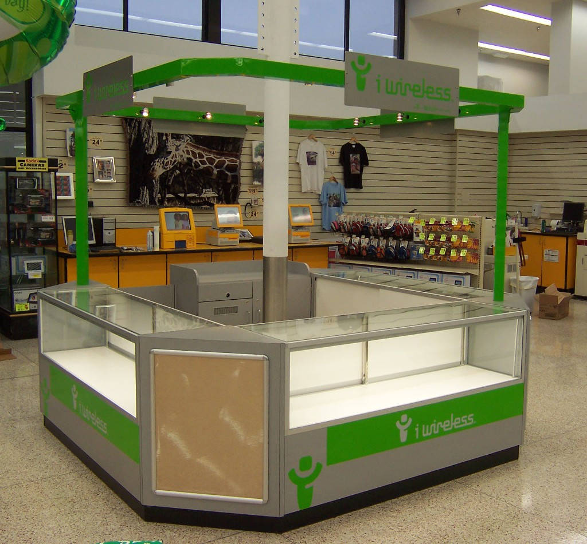
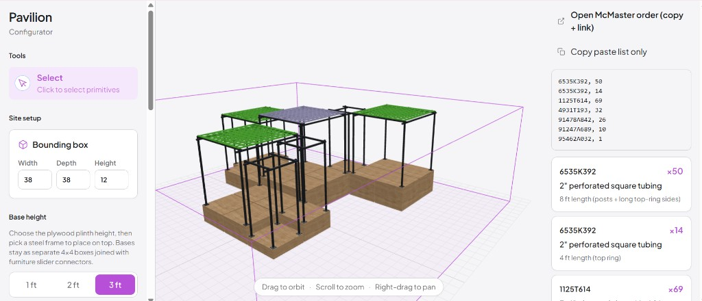
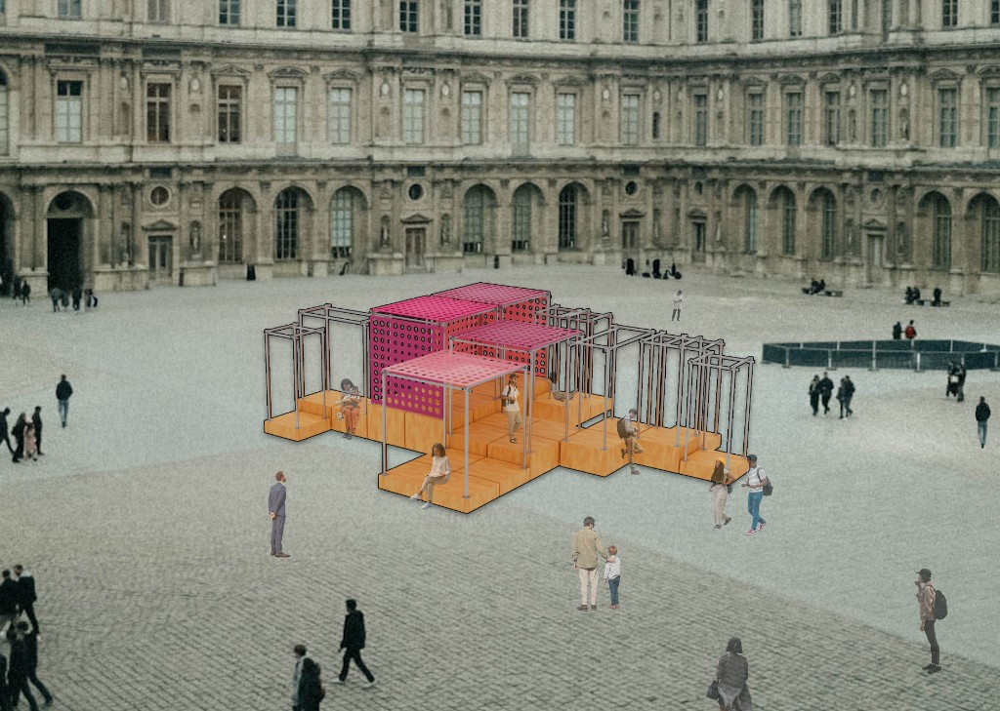

# Pavilion Configurator

The Pavilion Configurator is a project rooted in modularity, temporary structures, and DIY spirit. Taking the form of a website, the canvas allows users to experiment with different types of modules to create a truly unique combination suited to any sites needs. The left menu navigates the controls, while the right menu keeps track of the materials needed for the setup in the canvas. It takes into account bolts, screws, lumber, plywood, and steel beams. Additionally, DWG files have been included for the matching stools and wall panels, so those with access to CNC Machines can easily replicate the point attractor pattern shown in the preview. Visitors can download the glb file of their creation or even a usdz file to experience it in-situ AR on the iPhone. 

Full instruction files with dimensions are also available via the right menu bar. The instructions go over hardware connections, dimensions, base assembly, furniture assembly, and provide and example layout.

My work directly builds upon two precedents: StockaStudio and my advisor, Adam Vosburgh's, Kallax Configurator. Both deal with modular furniture, but diverge in many other ways. Stock A Studio uses perforated square tubing, along with other industrial hardware, to create furniture that promises endless combinations. Their installations are bespoke and dramatically change depending on the event type. Adam's Kallax Configurator encourages users to experiment with their own version of Ikea's Kallax shelving units, while streamlining the DIY process by including many of the same materials I have incorporated into my own project.

Working in that framework, I began by designing the form. Ultimately, I picked the cube based on its inherent ability to be incorporated into a larger system. The Steel Frame on top provides cover, while allowing for additional connections in the future for many uses. Along the form-finding process I found a lot of inspiration in mobile kiosks, such as those found in the mall or vendors on the street. Much like Adam, I opted for a scrolling menu bar rather than a toolbox to maximize clarity! I did not want any potential users to get confused by small icons, opting for large and clear descriptions throughout.

The site itself is a React and TypeScript app built with Vite. Shared design state lives in a Zustand store, so when any changes are made, all panels update from the same source. The 3D view is powered by Three.js. Placement rules keep pieces inside the site, combine modules, prevent overlaps, and snap panels to frames. The materials logic counts the bases, beams, hardware, etc, that is used to update the bill of materials and generate the McMaster-Carr ordering sheet.

I came to this project with a desire to bring adaptable pavilion design/pop-up structures to the masses. As someone with experience in throwing events, any kind of custom staging or exhibition design is a large undertaking that is simply not worth it in most cases. I had hoped to bridge the gap with The Pavilion Configurator. This project does make that type of design more accessible, but it falls short by requiring intermediate woodworking experience and deep pockets. Each module costs several hundred dollars to make in their current state.

Despite falling short of some goals, I really enjoyed the design process. Actually thinking about the construction of an object provided an interesting challenge, while the website process introduced me to a world of interactivity I did not realize was so accessible. I naturally gravitated toward a project like this because of my own interest in modular furniture, a quality I wanted to bring to the built environment. There is something quite satisfying about taking a few modules and being able to produce nearly limitless permutations with meaningful differences.

